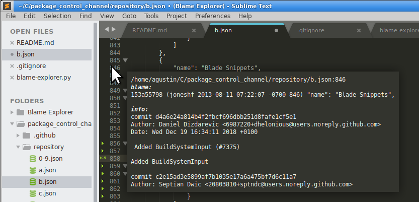
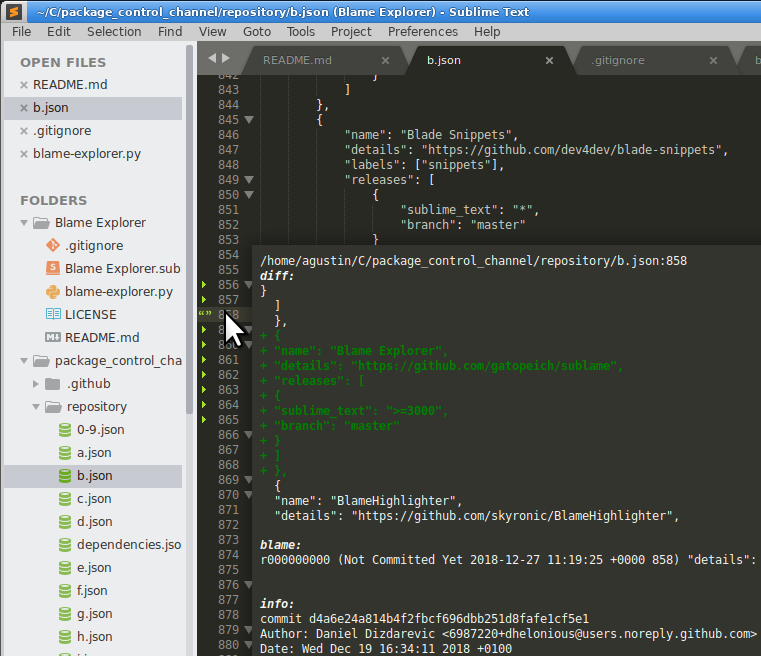

# Blame Explorer for Sublime Text 3

Seamlessly explore code's authorship and history from Sublime Text's gutter, just hovering over the line number.

Additionally, this plugin displays the diff chunk for the chosen line, if uncommitted changes are present.

Useful while working on years-old or poorly documented code, where one is frequently wondering about the reasons behind misterious/obfuscated expressions.

# Usage

Hover the pointer over the interesting line's number. SuBlame will fetch the file's "blame" history, then display the change log for the commit where the line was last changed.

* SVN and GIT are currently supported 
* Potentially slow operations are performed in background, with results cached
* File must be saved for diff feature to display correct output

For the diff functionality to be more handy, combine with any of the plugins that highlight changed lines on the gutter, like "VCS Gutter", "GitGutter", or "Modific".

# Screenshots

## Blame functionality:

## Diff functionality:

